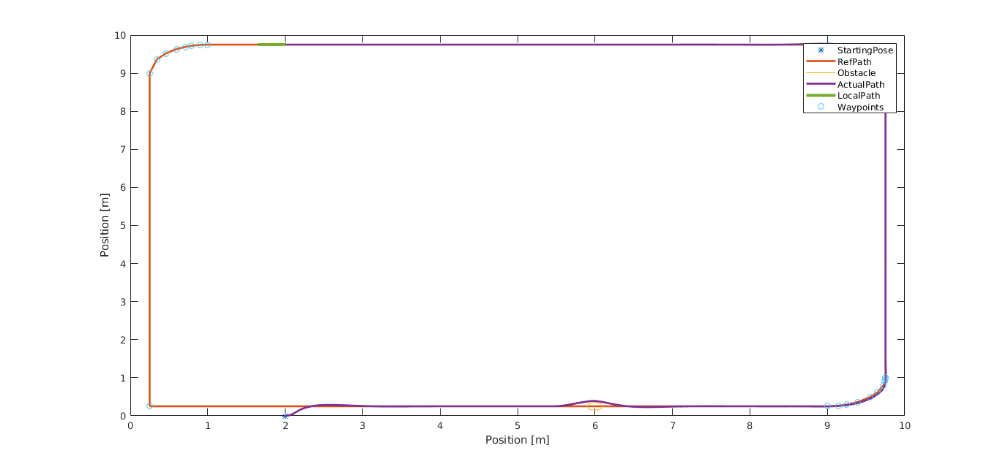
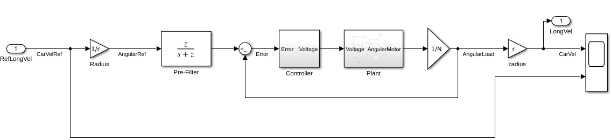
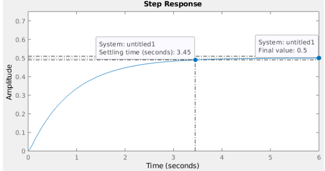
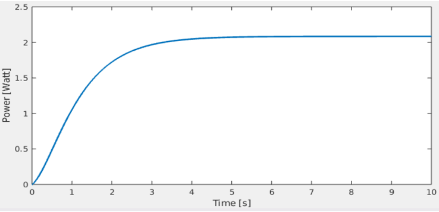
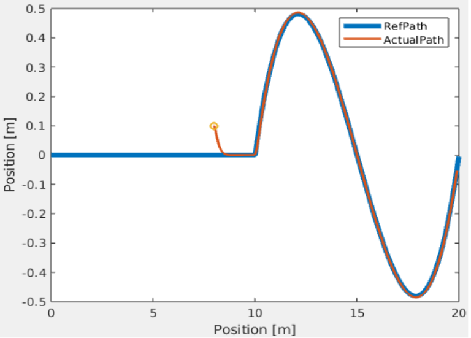

<!-- Improved compatibility of back to top link: See: https://github.com/othneildrew/Best-README-Template/pull/73 -->

<!--
*** Thanks for checking out the Best-README-Template. If you have a suggestion
*** that would make this better, please fork the repo and create a pull request
*** or simply open an issue with the tag "enhancement".
*** Don't forget to give the project a star!
*** Thanks again! Now go create something AMAZING! :D
-->

<!-- PROJECT SHIELDS -->
<!--
*** I'm using markdown "reference style" links for readability.
*** Reference links are enclosed in brackets [ ] instead of parentheses ( ).
*** See the bottom of this document for the declaration of the reference variables
*** for contributors-url, forks-url, etc. This is an optional, concise syntax you may use.
*** https://www.markdownguide.org/basic-syntax/#reference-style-links
-->
<!-- PROJECT LOGO -->

<!-- TABLE OF CONTENTS -->

  
Table of Contents

  <ol>
    <li>
      <a href="#about-the-project">About The Project</a>
    </li>
    <li>
      <a href="#controller">Controller</a>
      <ul>
        <li><a href="#longitudinal-controller">Longitudinal Controller</a></li>
        <li><a href="#lateral-controller">Lateral Controller</a></li>
          <ul>
              <li><a href="#kinematic-model">Kinematic Model</a></li>
          </ul>
      </ul>
    </li>
    <li><a href="#path-planning-with-obstacle-avoidance">Path-Planning-with-Obstacle-Avoidance</a></li>
    <li><a href="#license">License</a></li>
    <li><a href="#contact">Contact</a></li>
    <li><a href="#acknowledgments">Acknowledgments</a></li>
  </ol>

<!-- ABOUT THE PROJECT -->
## About The Project
This project aims to generate a path for given a sets of 2D waypoints when there is a obstacle along the path and follow the generated path using controlling algorithm for [ROSbot 2](https://husarion.com/manuals/rosbot/). For example when the algorithm is given a sets of waypoints in 2D, it generates a GLOBAL path between these waypoints and creates a LOCAL path at each time step using "LOOKAHEAD" distance. And then it follows the generated local path. It consists of 2 parts called "CONTROLLER" and "PATH PLANNING". In the following sections, I am going to describe the details of the algorithm so that you can easily understand and use it for your applications.
 

  
  

    Result
  

As we can from Figure 1, there are several waypoints which we give them to algorithm as an inputs. The time algorithm takes the inputs from the user, it creates a path. Reference Global path can be seen in range color. And ROSbot starts it motion at (2, 0) point. And then starts to follow the path using control algorithms. One of the most important thing here is that there is an obstacle at (6, 0). And the algorithm uses that information to pass near the obstacle.

(<a href="#readme-top">back to top</a>)

## Controller
You can read the full report of CONTROLLER task. [REPORT](https://drive.google.com/drive/u/1/folders/1hVpCoH-6AStXR6jbHeMdJpH4t_2Ol69Y)

First main subsystem of the whole algorithm is "CONTROLLER" part. It consists of 2 componenets. First one is "Longitudional Controller" and the second one is "Lateral Controller". Longitudional Controller basically controls the linear speed of the ROSbot while Lateral Controller controls the steering angle of the ROSbot to follow the generated path in a smooth way. You can find the DC motor which was used in this project by clicking [here](https://husarion.com/manuals/rosbot/). In the following parts, I will give more informations about "Lateral" and "Longitudional" controller.
### Longitudinal Controller
The main goal of "Longitudional Controller" is to control the angular velocity of the DC motor for a given reference angular velocity. And the controller is designed according to the following characteristics.
- Zero steady-state error
- Settling time= 3.5 seconds
- No overshoot
Using the parameters listed in the [REPORT](https://drive.google.com/drive/u/1/folders/1hVpCoH-6AStXR6jbHeMdJpH4t_2Ol69Y) and technical specifications, P and I coefficients are calculated.
Figure 2 shows the main block diagram of this controller.
 

  
  

    Block Diagram of Longitudional Controller
  

To make it simplier, I converted angular velocity to linear velocity. So when we give 1 to this controlling algorithm as an input, the velocity of ROSbot become 1m/s. You can set different values of velocity by channing "RefLongVel" variable in MotionPlanningv15.slx-->CONTROL-PATH-->RefLongVel

Figure 3 and figure 4 shows the step response and power response respectively.
 

  
  

    Step Response
  

 

  
  

    Power Response
  

### Lateral Controller
The main goal of "Lateral Controller" is to control the steering angle of ROSbot to follow the generated path smoothly. For this purpose "STANLEY" method was used as a lateral controller algorithm. The Stanley method is the path tracking approach used by Stanford University’s autonomous
vehicle entry in the DARPA Grand Challenge, Stanley. It is a nonlinear control law for an
automobile to autonomously track a trajectory, provided in real-time, on rapidly varying, off-road
terrain. You can [read](http://ai.stanford.edu/~gabeh/papers/hoffmann_stanley_control07.pdf) the paper.
#### Kinematic Model
A kinematic model for the lateral motion of a vehicle can be developed. Such a model provides a
mathematical description of the vehicle motion without considering the forces that affect the
motion. The equations of motion are based purely on geometric relationships governing the system.
And for this project "BICYCLE MODEL" was used. Figure 5 shows the results of "STANLEY" algorithm.
 

  
  

    Simulation Result for Stanley Control Algorithm
  

## Path Planning with Obstacle Avoidance

## License

Distributed under the MIT License. See `LICENSE.txt` for more information.

(<a href="#readme-top">back to top</a>)

<!-- CONTACT -->
## Contact

Tumucin : baltumucin34@gmail.com

Project Link: [Arcore - Motion - Tracking](https://github.com/Tumucin/Arcore-Motion-Tracking)

(<a href="#readme-top">back to top</a>)

<!-- ACKNOWLEDGMENTS -->
## Acknowledgments

You can check out the resources that I find very useful. 

* [ARCore Data Logger](https://github.com/PyojinKim/ARCore-Data-Logger)
* [Android Sensor Coordinate System](https://developer.android.com/guide/topics/sensors/sensors_overview#sensors-coords)
* [SensorEvent](https://developer.android.com/reference/android/hardware/SensorEvent)
* [ARcore - Quick Start for Android](https://developers.google.com/ar/develop/java/quickstart)
* [The Template that this project uses.](https://github.com/othneildrew/Best-README-Template)

(<a href="#readme-top">back to top</a>)

<!-- MARKDOWN LINKS & IMAGES -->
<!-- https://www.markdownguide.org/basic-syntax/#reference-style-links -->
[product-screenshot]: images/screenshot.png
[Next.js]: https://img.shields.io/badge/next.js-000000?style=for-the-badge&logo=nextdotjs&logoColor=white
[Next-url]: https://nextjs.org/
[React.js]: https://img.shields.io/badge/React-20232A?style=for-the-badge&logo=react&logoColor=61DAFB
[React-url]: https://reactjs.org/
[Vue.js]: https://img.shields.io/badge/Vue.js-35495E?style=for-the-badge&logo=vuedotjs&logoColor=4FC08D
[Vue-url]: https://vuejs.org/
[Angular.io]: https://img.shields.io/badge/Angular-DD0031?style=for-the-badge&logo=angular&logoColor=white
[Angular-url]: https://angular.io/
[Svelte.dev]: https://img.shields.io/badge/Svelte-4A4A55?style=for-the-badge&logo=svelte&logoColor=FF3E00
[Svelte-url]: https://svelte.dev/
[Laravel.com]: https://img.shields.io/badge/Laravel-FF2D20?style=for-the-badge&logo=laravel&logoColor=white
[Laravel-url]: https://laravel.com
[Bootstrap.com]: https://img.shields.io/badge/Bootstrap-563D7C?style=for-the-badge&logo=bootstrap&logoColor=white
[Bootstrap-url]: https://getbootstrap.com
[JQuery.com]: https://img.shields.io/badge/jQuery-0769AD?style=for-the-badge&logo=jquery&logoColor=white
[JQuery-url]: https://jquery.com 
